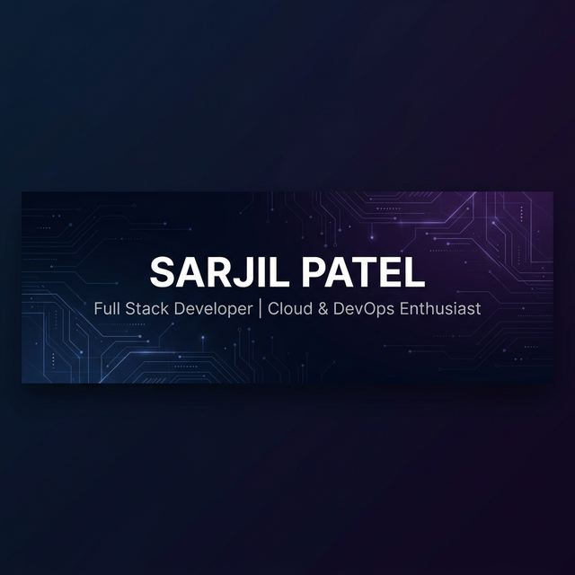

 
 <!--Header-->

 

 

<!--Intro-->

 
## 𝐇𝐞𝐥𝐥𝐨 𝐭𝐡𝐞𝐫𝐞, 𝐟𝐞𝐥𝐥𝐨𝐰 <𝚌𝚘𝚍𝚎𝚛 />! 

> [!CAUTION]
> - 🔖 Welcome to my Digital Garden 🚀

> [!NOTE]
> - 🏢 I’m currently working as an **Associate Full Stack Developer** at **ZealousWeb Technologies**.

> [!IMPORTANT]
> - 🛠️ Currently building **React Launch**, a Vercel-like deployment platform for rapid app delivery.

> [!WARNING]  
> - ☁️ Mastering Cloud Infrastructure: Moving deeper into **AWS Lambda, ECS, and Infrastructure as Code**.

> [!TIP]  
> - 💬 Let's chat about Scalable SaaS architectures, DevTools, or deployment automation!

> 

>  
>   
>   
> 

---

<!--Skills-->

 

<h3 align="center">
 
 
 
 【Ｓｋｉｌｌｓ】  
</h3>

 
  

| **Category** | **Technologies** |
| :--- | :--- |
| **🚀 Frontend** |     |
| **⚙️ Backend** |    |
| **🗄️ Databases** |    |
| **☁️ Cloud & Ops** |    |
| **🔧 Tools** |    |

<!--STATS-->

<h3 align="center">
   【Ｓｔａｔｓ】 

</h3>
 

  

 

 <!--More Stats-->

 

  
📈 More Analysis

   

 <a href="https://github.com/sarjilpatel"> 
   

  
  
 </a>

  
 

 

<!--SNAKE-->

 

<!--Projects Section (Adapted)-->

  
📁 Featured Repositories

   

  

    
    
  

 

<!--SPOTIFY / HOBBIES-->

 <h2 align="center">
   【H o b b i e s & V i b e s】
</h2>

 

  

 

 <!--MOON-->
 
<a href="https://github.com/sarjilpatel"> 
  
<a href="https://github.com/sarjilpatel"> 
  

 
 

👏 Community Support 

 

  

<!-- THANKS-->

 

  

