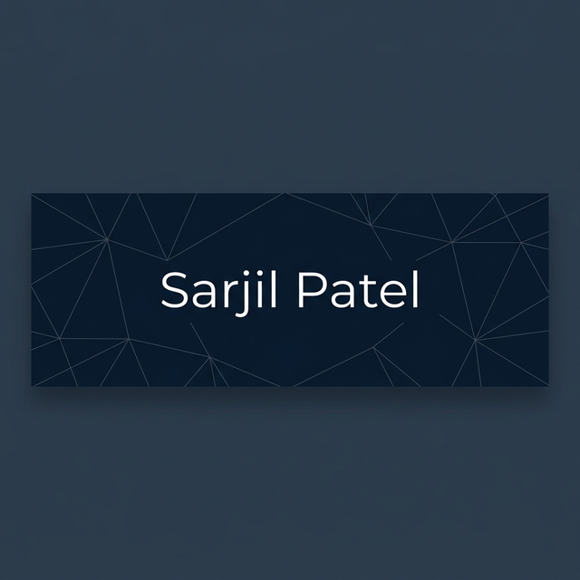

# 
Sarjil Patel

  

  

---

### 💫 About Me

I am a passionate **Full Stack Developer** at **ZealousWeb Technologies** based in India. I specialize in building scalable web applications and cloud-based platforms. I have a deep interest in modern JavaScript frameworks and backend systems, with a particular focus on developer experience and automation.

- 🏗️ **Currently focusing on**: Developer Infrastructure & Deployment Systems
- ☁️ **Cloud Specialist**: AWS Ecosystem (EC2, S3, Lambda, ECS, ECR)
- 🚀 **Building**: Scalable SaaS products and DevTools
- 🛠️ **Passion**: Automation platforms and streamlined deployment pipelines

---

### 🛠️ Tech Stack

#### 🌐 Frontend & UI

  

#### ⚙️ Backend & Infrastructure

  

#### 🔧 Tools & Workflow

  

---

### 🚀 Featured Projects

<table border="0">
  <tr>
    <td width="50%" valign="top">
      <h4>🌐 React Launch</h4>
      
A Vercel-like deployment platform where users can deploy applications easily. Built with React, Node.js and sophisticated cloud infrastructure concepts.

      

        
        
        
      

    </td>
    <td width="50%" valign="top">
      <h4>🎫 TixStock</h4>
      
A specialized ticket inventory management platform featuring tight AWS S3 integration for robust asset handling.

      

        
        
        
      

    </td>
  </tr>
  <tr>
    <td width="50%" valign="top">
      <h4>🏢 ZealOverview</h4>
      
Internal company ecosystem built for ZealousWeb Technologies using a modern stack for high-performance internal operations.

      

        
        
        
      

    </td>
    <td width="50%" valign="top">
      <!-- Future Project Placeholder -->
    </td>
  </tr>
</table>

---

### 📊 GitHub Analysis

  
  

  

---

### 📫 Get in Touch

  
  
  

---

  <i>"Simplicity is the soul of efficiency." – Austin Freeman</i>

  

